[**home**](../README.md)

![Color Waves Logo][logo]

[logo]: md/logo_colorwaves-08.png "Logo Title Text 2"

## Spread the colors in B/W cities!

**JOYPAD WORKSHOP**  
GAME x INTERACTIVE DESIGN  

*Project by Alia ElKayar, Armand Lemaitre, Guillaume Le Mené & Slévin Vleöbergh*

 

- <u>**Genre </u>:**  Rythme/Reflexion  
- <u>**Nombre de joueurs </u>:** 3  
- <u>**Objectif </u>:** Chaque joueur contrôle une couleur primaire, ils doivent alors se coordonner pour reproduire la couleur centrale avant la fin du temps imparti.

  
____

 

### <u>Réflexion</u>
Pour commencer, nous nous sommes tournés vers des références de party-game.
Par exemple, on s’est penché sur des titres comme Wii Party, Mario Party, Rythm Paradise ou encore Bomberman. Le point commun entre ces jeux est l’amusement qu’ils procurent à plusieurs avec une courte expérience. Ainsi, nous avons voulu garder cette particularité du jeu à plusieurs et instaurer une coopération. 
Plusieurs idées ont émergé, nous avons voulu partir sur un jeu de rythme / réflexion en nous inspirant du jeu Rythm Paradise. Rapidement, l’idée d’un jeu basé sur les couleurs est ressortie, le rendant accessible à un large public. 

*Brainstorming fait sur [Real Time Board] (realtimeboard.com)*
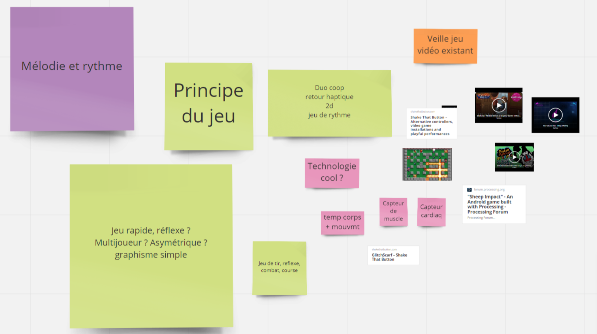 

- [Gameplay de Wii Party] (https://www.youtube.com/watch?time_continue=1413&v=fwXplJNIhpQ)
- [Gameplay de Rythm Paradise] (https://www.youtube.com/watch?v=L-PxepfoA7M)

 
Autres jeux :
    
- [Star Whale] (https://www.youtube.com/watch?v=zjUGbw4RxCg)       
- [Piano Tiles] (https://www.youtube.com/watch?v=fqOW84ZTL7k)   

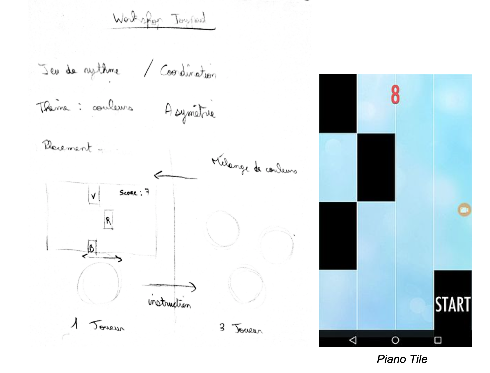

Au début, nous avons pensé à un jeu au gameplay asymétrique : un joueur / meneur voit la couleur sous forme de bloc arriver sur l’écran, il l’annonce à trois autres joueurs qui doivent la reproduire au plus vite. Ces derniers contrôlent chacun une couleur primaire (Rouge, Vert, Bleu), le challenge est donc de réussir à se coordonner afin de reproduire la couleur. Une fois la couleur faite, le meneur doit se positionner sur un axe horizontal afin de rejoindre le prochain bloc (l’interface est semblable à celle d’un Piano Tiles). 

 

### <u>Le Jeu</u>
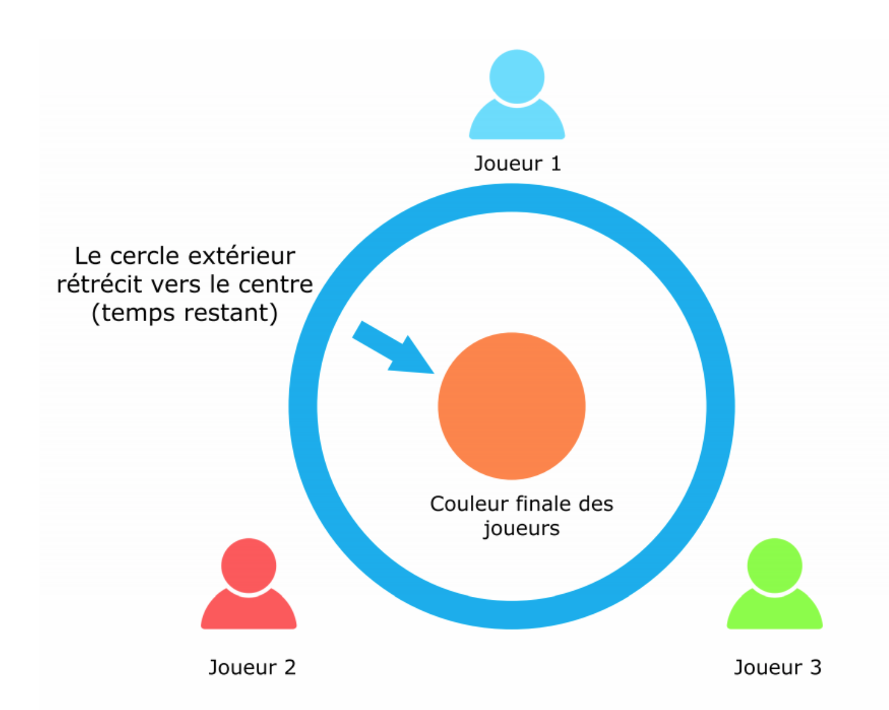

Chaque joueur possède un capteur différent (distance, force et flexion) afin de pouvoir modifier la nuance de leur couleur. Le cercle central correspond à la couleur qu’ils ont composé. En parallèle, le cercle extérieur correspond à la couleur qu’ils doivent reproduire. Après avoir réalisé leur couleur, ils passent à la suivante, avec moins de temps accordé à chaque fois. Plus la partie dure longtemps, plus le score est élevé. Lors d’une nouvelle couleur, les joueurs peuvent tourner et échanger leur capteur afin de compliquer la partie.

Pour continuer, voyant bien que créer des couleurs n’avait rien de palpitant, on a voulu exagérer l’impression de puissance des joueurs grâce à un univers basé autour des superhéros. On s’est notamment inspiré des séries “super sentai” (super escadron en japonais) dont les fameux Power Rangers. 
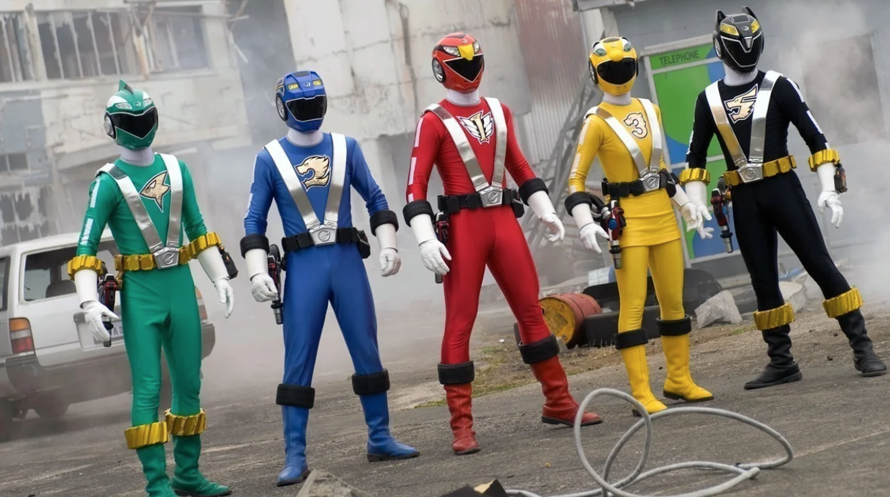

Ainsi, on a eu l’idée d’associer un pouvoir et un symbole pour chaque couleur contrôlé par le joueur : rouge / force, bleu / air, vert / flexion, par l’intermédiaire d’un gant qui fait office d’accessoire de jeu.  

 

### <u>Concept </u>

**Superheros de Color Waves :** FlexIndex, SuperStrike & Ultrasonic 
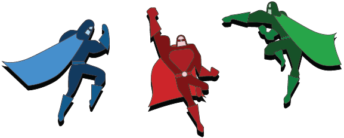

Les Superhéros coopérer pour coloriser les villes tristes en noir et blanc.

**Sur l'écran :**
- Un cercle au centre qui représente le résultat de l'addition des trois couleurs.   
- 3 cercles pour chaque pouvoir/couleur. Lorsque la ligne est lisse, c'est donc la bonne dose de couleur.   
- Cercle qui se rapproche du cercle au milieu : représente le temps qui s'écoule et c'est la couleur à créer.      
- Plus en avance dans le jeu, plus le temps par couleur s'écoule vite.   

**Règles du jeu :**  
1. Portez les gants et devenez un superhéro ayant un super-pouvoir magique.     
2. Demarrez le jeu en activant les capteurs.    
3. Reproduisez le maximum de couleurs affichées 
sur l'écran le plus rapidement possible   
à l'aide de vos super-pouvoirs.   

**Les Super-pouvoirs :**   
- FlexIndex génère la couleur BLEU en pliant son index plus ou moin fort.  
- SuperStrike génère la couleur VERTE grâce à la force de son pouce, en appuyant plus ou moin fort.   
- Ultrasonic génère la couleur ROUGE grâce à sa telekinesie, en éloignant plus ou moins ses mains.   

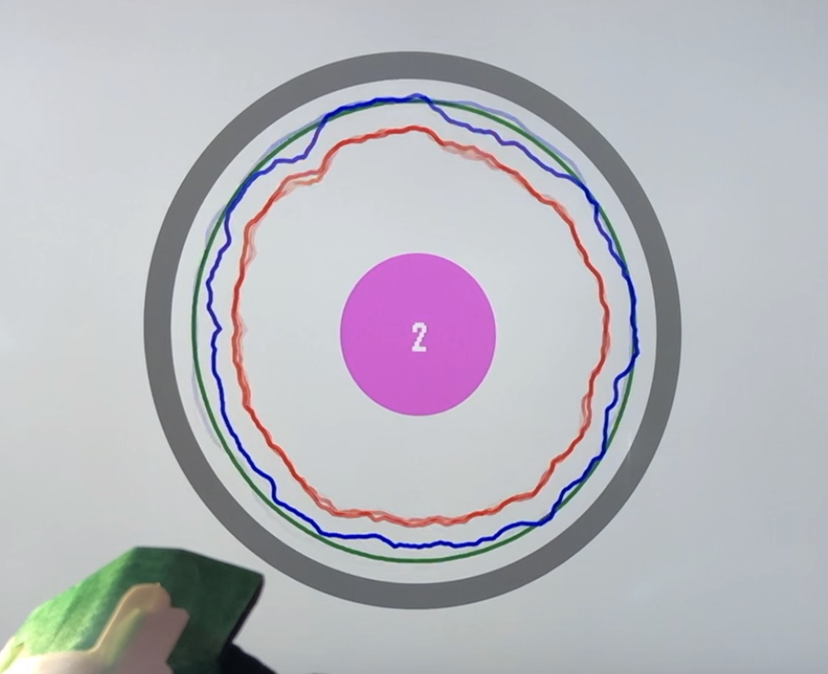
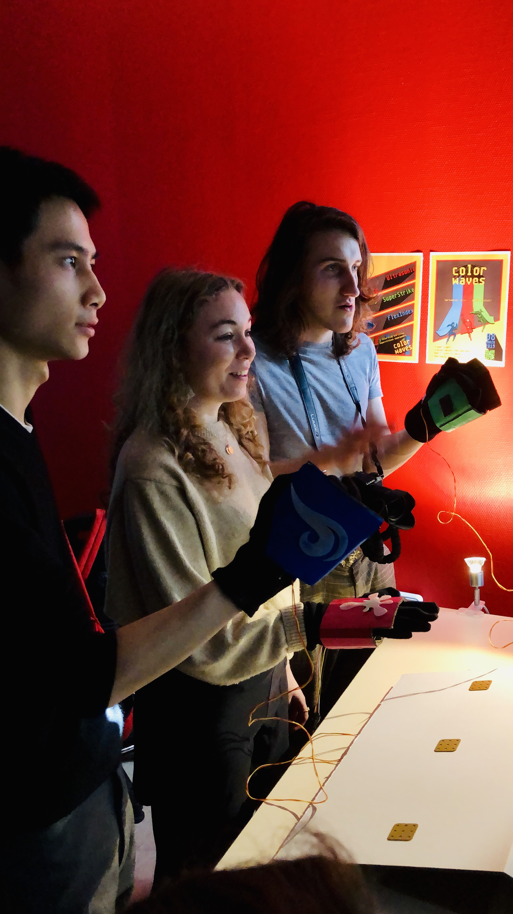
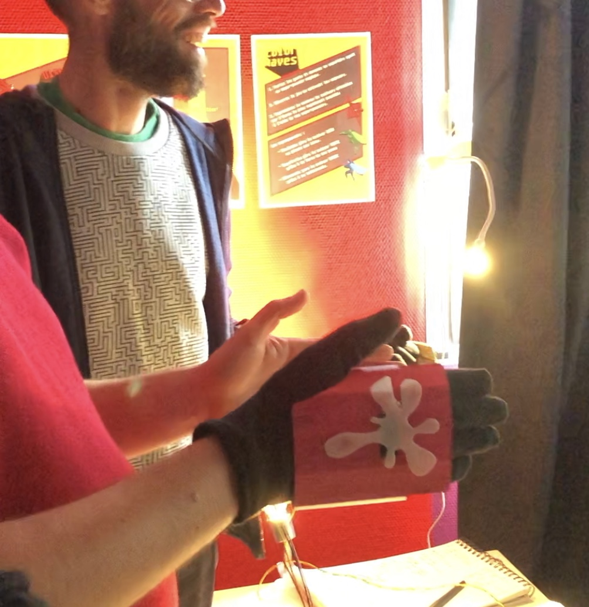

 

### <u>Materiel </u>
**Arduino**  
- 1 Force Sensitive Resistor  
- 1 Flex sensor  
- 1 Ultrasonic Sensor  

**Autre**   
- Un écran  
- 3 gants 

 

### <u>Étapes des assemblages</u> 

####md/ **Parties électroniques**  

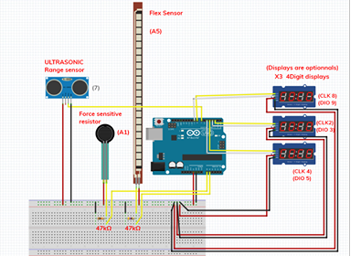
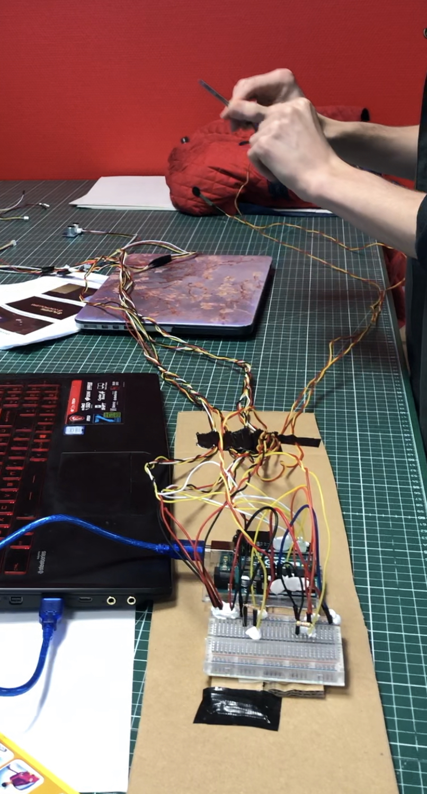

 

#### **Parties non-électroniques**  

**Gants :** *Gants + Carton + Peinture + Icône Superhéro + Capteur :* 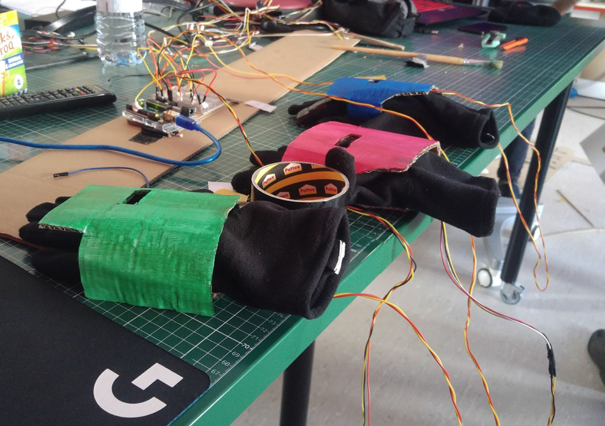
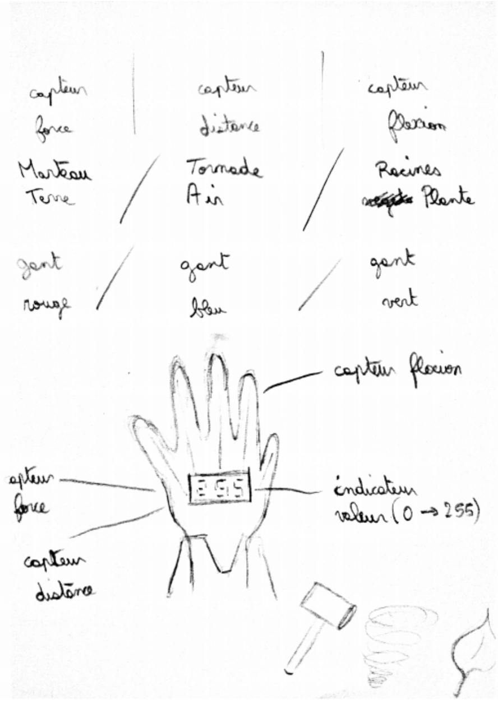
 

**Porte gants :** *Gants + Icônes Superhéros 3D + Aimants + Carton :* 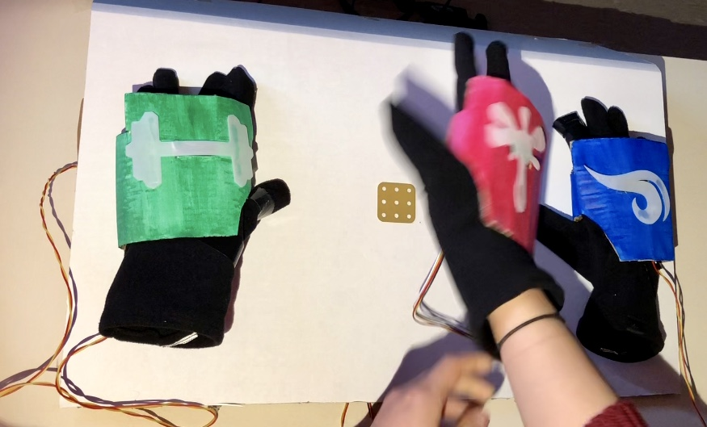

 

### <u>Prints</u> 
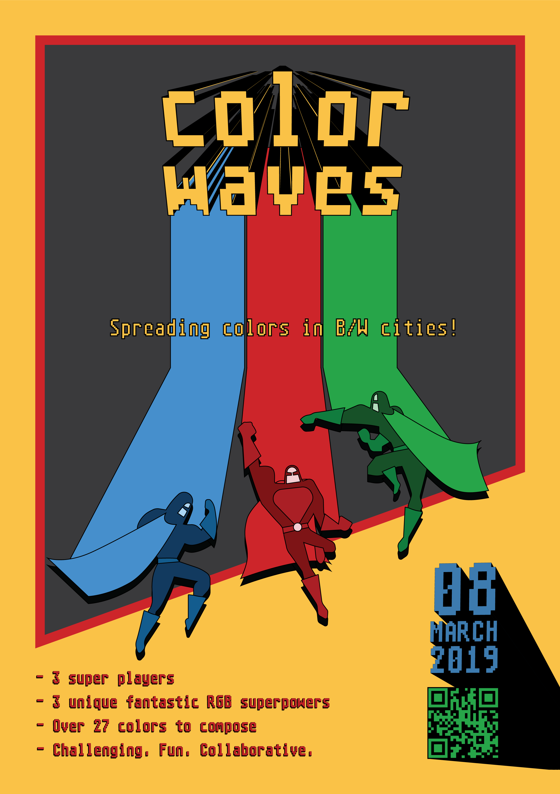 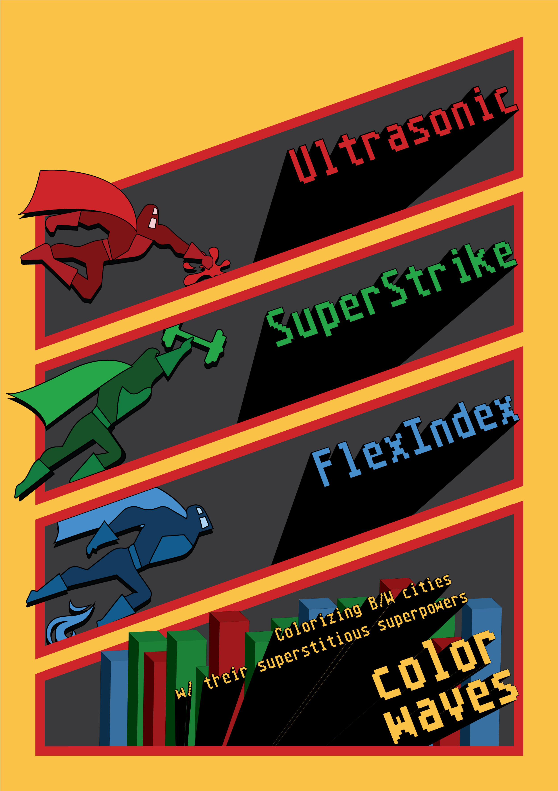 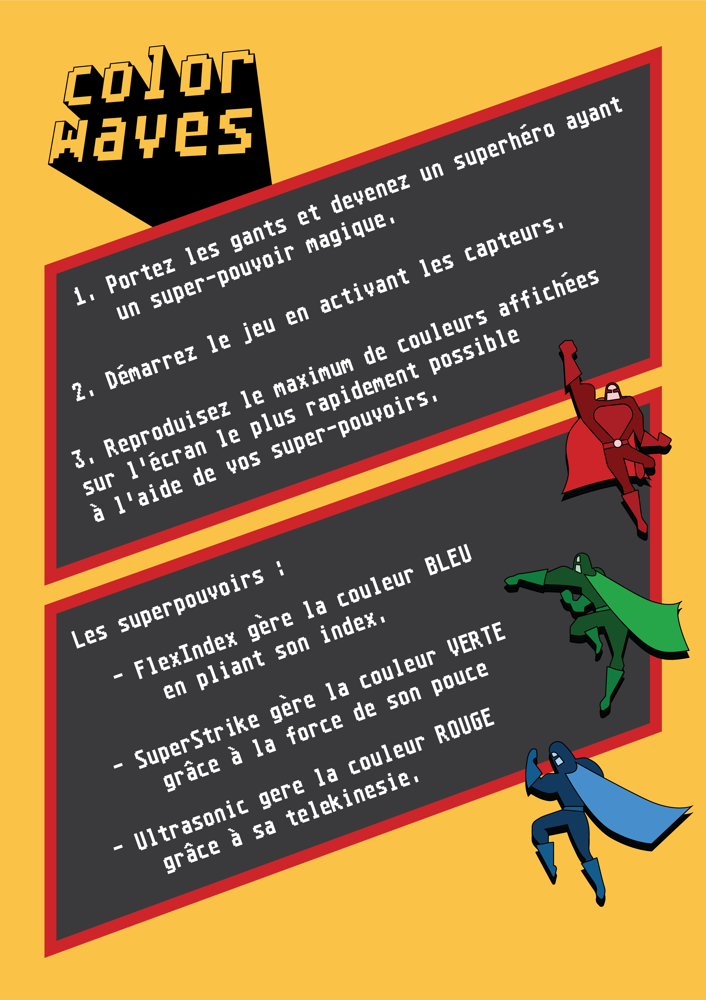

 

**_#MarsDigital  
_2019**

[**home**](../README.md)