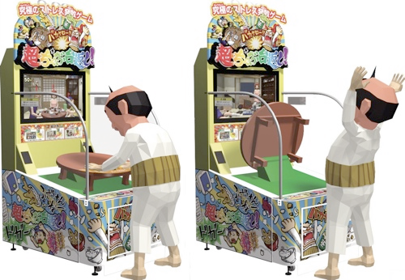
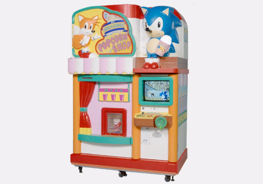
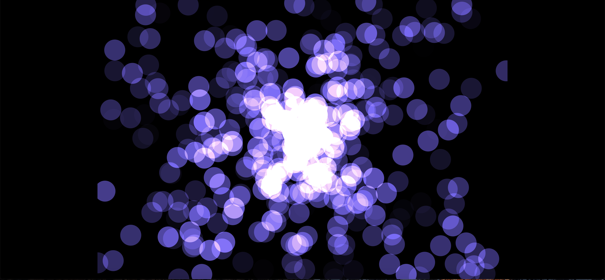
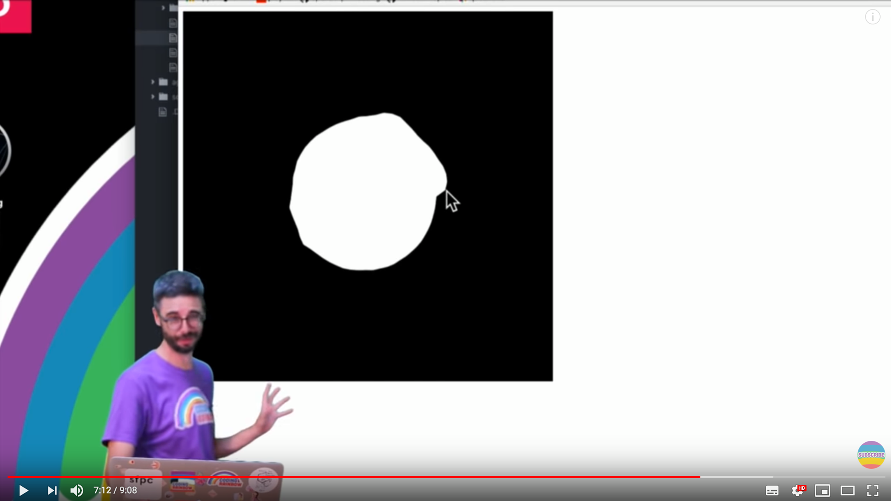
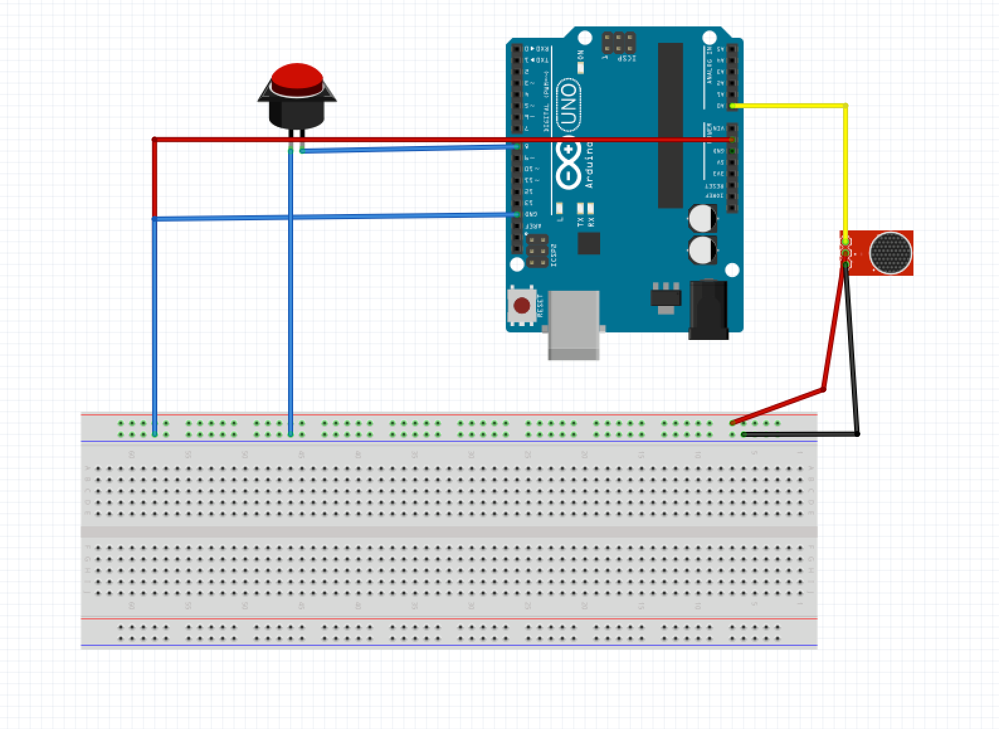

# FUGU-FUGU
### Jeu basé sur Arnuino et Processing

###### Réalisé par Bastien Adam, Hélène De Guibert, Bastien Trichereau, Théo Monnin, Noé Martineau
---
## Le principe
Fugu-fugu est un jeu inspiré des bornes d'arcade japonaises dans un esprit Kawaii. 4 joueurs s’affrontent dans un mini jeu où la tension est omniprésente. Le jeu consiste à souffler dans un ballon commun à tous les joueurs, tour à tour les joueurs vont devoir souffler dans le ballon jusqu'à ce que celui-ci explose, celui qui est responsable de l’explosion du ballon se voit retirer tous les points qu’il a gagnés durant la partie. Pour gagner des points il vous suffit de souffler dans le ballon, le gain de points est exponentiel, plus le ballon s’approche de l’explosion plus le gain de points est élevé. Le joueur qui fait exploser le poisson se voit retirer tous les points qu’il a gagnés durant le round.

## Documentation
Le Japon étend depuis des années sa culture si particulière à l'échelle mondiale via divers moyens : Cuisine, mangas, animés, musique, vêtements, mais également jeux vidéos. On parle alors de soft power. La culture du jeu vidéo est très importante et développée en Asie généralement(Japon, Corée notamment). Voici quelques jeux what the fuck qui nous ont inspirés lors de la réalisation et le controller utilisé pour le projet. 

### Cho Chabudai Gaeshi
Cho Chabudai Gaeshi, traduit par "Super Tea Table Flip". Le meuble d'arcade est équipé d'une table à thé que le joueur utilise comme contrôleur. Le but du jeu est de causer autant de dégâts monétaires que possible en retournant la table. Cho Chabudai Gaeshi récompense également les joueurs pour la "longueur" du flip de la table à thé.

### Boong-Ga Boong-Ga
Boong-Ga Boong-Ga, aussi connu sous le nom de Spank'Em a été initialement sorti au Japon en 2000. C'est, à notre connaissance, la première et la seule machine d'arcade au monde avec des fesses interactives. Plus vous les frappez fort, plus vous êtes près de gagner un caca en plastique.

### SegaSonic Popcorn Shop
SegaSonic Popcorn Shop (セガソニック セガソニック ポップコーンショップ SegaSonikku Poppukōn Shoppu ?) est un distributeur automatique d'arcade sorti en 1993, exclusivement au Japon. Créé par Sega AM1 et sorti par Sega, c'est une combinaison d'une machine à popcorn et d'un mini-jeu sur la carte C-2 de Sega, un matériel similaire à celui de la Sega Genesis. Le distributeur automatique distribue du maïs soufflé dans l'une des trois saveurs suivantes : salé, beurre ou curry. Le petit écran du distributeur automatique comporte également un mini-jeu, mettant en vedette Sonic et Tails, qui aident à faire du pop-corn pendant que le Dr Eggman essaie de ruiner l'événement. Pendant que le mini-jeu est joué, le pop-corn est mis au micro-ondes dans un compartiment voisin. Comme dans beaucoup de jeux d'arcade liés à Sonic, Takeshi Kusao et Masaharu Satō ont fourni les voix de Sonic et du Dr Eggman.

## Sources

"[https://www.openprocessing.org/sketch/633781]()" -par Veran- Pour générer des particules.

"[https://www.youtube.com/watch?v=rX5p-QRP6R4]()" The Coding Train. Comprendre et réaliser un blobbing effect. 

## Les composants :

#### - LE BOUTON -

Le bouton a pour utilité de lancer et relancer une partie. Il permet aussi d'indiquer un changement de joueur.

--

#### - LE MICRO -

Le micro est utilisé pour détecter le souffle. Suffle qui fera gonfler petit à petit le poisson FUGU-FUGU.

--

## fugu-fugu

### LE MATÉRIEL
###### L'électronique
* 1 carte Arduino
* 1 cable USB
* 1 breadbord et des câbles
* 1 micro
* 1 bouton poussoir

###### La maquette
* Des plaques de bois
* Peintures
* Des pointes

### Le montage

--

### La maquette

--

## Une V2
### Les points à améliorer
* Une flèche indiquant quel joueur doit jouer son tour
* Une meilleure gestion des joueurs avec un timer pour ne plus avoir à changer manuellement les tours des participants
* Intégrer le sound design réalisé (éclatement / bruit de gonflement).
* Indiquer le joueur gagnant à la fin de la partie
* Repositionner le micro au devant du tuyau pour une meilleure captation du son