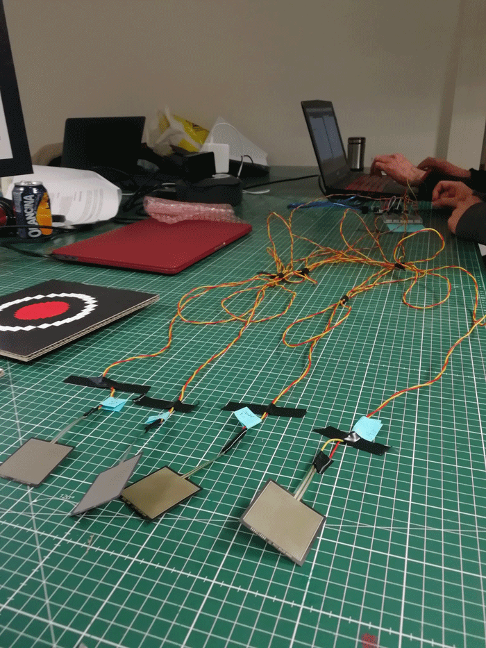

[**home**](../README.md)

# Hysteric Jumper
---

**Lengliang LI - Yacine El Makhzoumi - Samuel Lefebvre - Camille Campo**

---

## Contexte
Projet réalisé dans le cadre d'un workshop entre la classe bachelor 3ème année de Game design et la classe d'interactivité.

## Le brief
La demande était de concevoir un mini-jeu, rapide, simple et attrayant intégrant une interface graphique et un contrôleur de jeux inventé par nos soins et qui se veut original

## Notre réflexion
Après plusieurs brainstormings, nos premières idées se sont portées sur l'utilisation de la main et de gants sur lesquels seraient greffés des capteurs pour servir de contrôleur à notre futur jeu. Autour de ce contrôleur, nous avions établi plusieurs gameplay :

### 1- Notre première idée, une courses basée sur de la physique de deux balles.
Le jeux, deux balles devaient atteindre le plus rapidement l'arrivée sur un parcours horizontal et vallonné. Notre première idée s'appelait "deux boules de neige aux jeux olympiques". 

La particularité de ce concept était de jouer avec la physique des balles et la variation de leurs tailles pour leur permettre de prendre de la vitesse ou d'en perdre en fonction de la géographie du parcours (en prenant en compte les montées et les descentes de notre map.) De ce premier concept nous avions utilisé la librairie fisica pour réaliser la physique de la balle. Suite à certains problèmes techniques (problème dans la gestion de la gravité de notre balle et du terrain) nous avons changé de librairie et utiliser la librairie "Nature of code" et Box2D. Nous avons ensuite conçu un terrain grâce à une courbe sinusoïdale. Très vite nous nous sommes confronté de nombreuses contraintes techniques : Des éléments invisibles sur notre terrain faisaient bugger notre balle. La physique de la balle était très compliquée à gérer avec le parcours horizontal que qu'on avait et nous permettait pas de réaliser le parcours entièrement car la balle perdait tout au long du parcours de la vitesse et ne pouvait pas atteindre la ligne d'arrivée. Aussi les changements de taille de la boule et les impulsions que nous voulions leur donner apportait des contraintes techniques trop complexe et ambitieuse.

###Brainstormings, notre première idée de concept

###Conception de notre premier controleur
Pour notre premier contrôleur nous avions intégré un capteur de pression pour servir de jump à notre jeu et un capteur de flexion pour faire varier la forme de notre balle et sa physique.

### 2- Notre seconde idée, un terrain en descente

Suite à notre problème précédent était de ne pas pouvoir amener notre bille pointe d'un A jusqu'à B dans le cas d'un terrain horizontal, nous avons donc décidé de créer une course verticale, où le but était de faire dévaler nos "deux boules de neige" en prenant les chemins les plus statiques. Or le même bug technique lié à la map (lévitation de nos boules) persistait et nous avons décidé de partir sur une piste très simplifiée de notre jeu initial par manque de temps.

### 3- Une courses entre deux boules, parcour simplifié

Notre dernière solution a été d'abandonner l'utilisation de box2 de et d'oublier l'aspect de physique. Sur la même idée de jeu précédent, nous avons créé une course entre deux boules. Leur objectif est d'atteindre le plus rapidement le bas de la map pour que l'un des joueurs marque un point. Pour réaliser ce projet nous avons de générer notre terrain grâce à une série d'images que l'on fait appel aléatoirement à chaque manche. Le fait d'utiliser une image réglait considérablement les bugs de terrains précédent. Ce système nous a permis de créer de nombreuses maps ce qui a dynamiser notre jeu et l'a rendu plus attrayant et inattendu.

## Nos sources / ressources 
### ressource de code :
Pour réaliser notre projet nous avons expérimenté plusieurs bibliothèque.

* Nature of code
* Box2D
* Fisica

### Nos inspirations de jeux :
* Mario game - http://processingjs.nihongoresources.com/test/PjsGameEngine/docs/tutorial/mario.html
* Jeu processing - https://www.openprocessing.org/browse/?q=game&time=anytime&type=all#
* game cut tree - https://www.openprocessing.org/sketch/607159
* The Somewhat Possible Game - https://www.youtube.com/watch?v=dUptKwTvtmE
* Micro machine - Jeux de courses voitures

## Notre jeu / Hysteric Jumper
Un jeu qui se veut frustrant, addictif et qui challenge les joueurs à chaque manche. Rapide à jouer et à rejouer en boucle.
Le jeu se joue grâce à deux contrôleurs pour chaque joueur, pour diriger les balles des joueurs devront sauter sur ses deux support pour diriger la balle vers la gauche ou vers la droite.

Nous avons choisi de positionner notre écran verticalement pour proposer une nouvelle expérience de jeu au participant. Aussi la position verticale nous permettait de concevoir des maps plus longues à parcourir et rendait le jeu plus fun.

### Notre scénario
Deux kangourous aux jeux olympiques s'affrontent dans la descente infernale des pistes de ski, le premier arrivé en bas de la piste est le vainqueur. Il faut éviter les obstable pour ne pas être ralenti et savoir jauger son jump pour arriver le premier. Jeux en 1V1 et en trois manches.

## Méchanique de jeux 
* Une partie se joue en trois manches
* Les joueurs vont dévaler différentes pistes de ski avec des parcours plus ou moins complexes.
* Quand l'un des joueurs arrive en bas d'une piste, la prochaine map s'active automatiquement
* Chaque map est configurée pour apparaitre aléatoirement selon 10 schémas différents.
* Si le joueur touche un obstacle (les concours de la map) Il perd en vitesse et se fait absorber par le décor, à lui de savoir gérer son saut.
* Quand la partie est terminée un écran vient indiquer le vainqueur
* Si les kangourous des joueurs sont bloqués, ils peuvent réactualiser la map en cliquant sur la touche R

## Les contôleurs
Les contrôleurs de notre jeu sont des socles dans lesquels sont intégrés des capteurs de pression. Chaque joueur possède deux socles, un pour le pied droit et l'autre pour le pied gauche. Le but est que le joueur joue en appyant sur le socle de droite et de gauche à manier le déplacement de la balle kangourou.

## Le matériel nécessaire
* 2- Quatre capteurs de pressions (2 par joueurs)
* 3- une  carte arduino
* 4- Bread bord
* 5- un écran PC avec bras rotatif

## Etape assemblage projet (electronique)
###Notre montage

## Etape assemblage projet (non electronique)
* Réaliser les illustrations sur illustrator (logo + univers graphique + graphisme des contrôleurs)
* Réaliser l'habillage de la borne : Se procurer du carton noir, contrecoller sur un premier carton le nom du jeu, placer le carton avec le nom du jeu sur le haut de l'écran
* Contrecoller sur deux autres carton un visuel représentant les joueurs. Disposer les cartons de part et d'autre de l'écran de sorte à mettre en vis-à-vis des deux illustrations de kangourou.
* Contrecoller sur du carton classique les visuels des contrôleurs (x4) découper chaque socle (pieds trois / pieds gauches). Disposer sous les socles du papier à bulle. Dans le papier à bulle placer le capteur de pression relié aux connexions.
* Placer le contrôleur côte à côte sur le sol, les fixer grâce à du scotch double face.
* Le jeu est près à être utilisé!!

## Installation finale

[**home**](../README.md)

 

