[**home**](../README.md)

## La pépite
---

Réalisé par **Fabien Gachet-Thoumine**, **Aurélie Caré**, **Auriane Pouzin** et **Quentin Hamon**

---

## RÉFLEXIONS

Après notre brainstorming, des idées se sont dégagées autour d'un handicap d'un des joueurs (la vue, l'ouïe ou le toucher non utilisé) mais aussi autour d'un jeu de "combat" avec deux équipes.

Nous avons penser tout d'abord à un labyrinthe dans laquel un joueur aveugle doit sortir grâce à ses gants qui vibrent quand un mur est proche. Un "coach" l'aide en lui parlant grâce à la carte dulabyrinthe.

Une autre idée est une idée d'alchimie où il faut doser les liquides afin d'avoir la bonne recette. Même recette, un joueur "handicap" et un joueur "coach" afin d'accomplir les différentes tâches.

Après réflexion et remique en question sur les idées précédentes, nous avons abandonner l'idée d'handicap. Nous sommes partis sur  et nous sommes partis sur une idée de montgolfière avec un capteur thermique afin de la faire monter et descendre,comme dans la vrai vie. Nous avons ensuite imaginé un deuxième joueur, qui devrait l'empêcher de faire quelque chose. Nous avons donc penser à une course poursuite, dans laquelle le premier joueur doit s'échapper et le deuxième joueur doit l'arrêter en envoyant des projectiles.

### LE JEU : LA PÉPITE

#### Histoire :

À l’instar du Dr. Samuel Ferguson de Jules Vernes
qui part explorer l’Afrique grâce à une montgolfière.
L’aventurier Rick Ventura souhaite partir de Mexico au
Mexique pour rejoindre Cayenne en Guyane. Lors de
son voyage, il survole un temple amérindien et aperçoit
au sommet de ce dernier, la plus grosse pépite d’or
qu’il n’ait jamais vu. Profitant de sa vitesse ainsi que
de sa hauteur, il réussit à attraper la pépite sans même
devoir se poser. Malheureusement pour lui, cette pépite
appartient aux indigènes du coin qui commencent à lui
tirer dessus dans l’espoir de récupérer la pépite.

#### Le but: 

Le jeu est une course poursuite. Ainsi, le premier joueur
incarné par Rick Ventura, doit échapper aux azteques en
esquivant leurs fléchettes jusqu’à être hors de leur territoire.
Le deuxième joueur incarne les azteques et doit toucher à
plusieurs reprise la montgolfière pour la faire tomber avant
qu’elle ne sorte du territoire Azteque.

#### Les manettes ou joypads : 

* **Pour le joueur 1:** La montgolfière a un capteur thermique afin de faire monter et descendre celle-ci grâce à un briquet. De plus, il y a 2 microphones qui se trouvent sur les côtés de la montgolfière. Ils permettent de bouger celle-ci en profondeur (en avant et en arrière) pour éviter les projectiles de l'adversaire.
* **Pour le joueur 2:** Un deuxième joueur joue avec une
sarbacane. Il souffle dedans pour lancer les flèches sur
la montgolfière. Il doit se déplacer dans l’espace devant
les capteurs (situés sur le côté de la table) pour jouer
sur les trois différentes lignes.

#### Les idées de graphisme:

**Pour la montgolfière :**

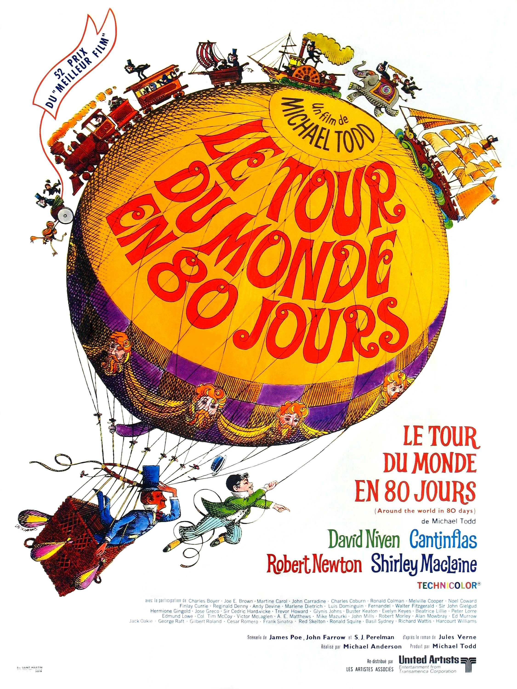
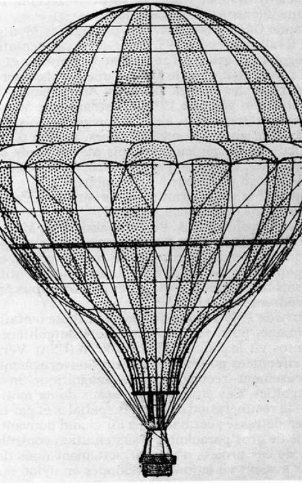
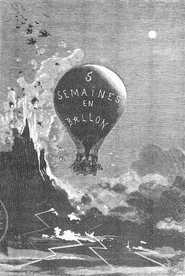

**Pour le fond :**

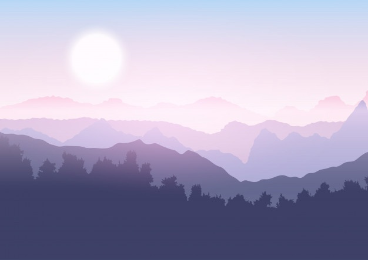
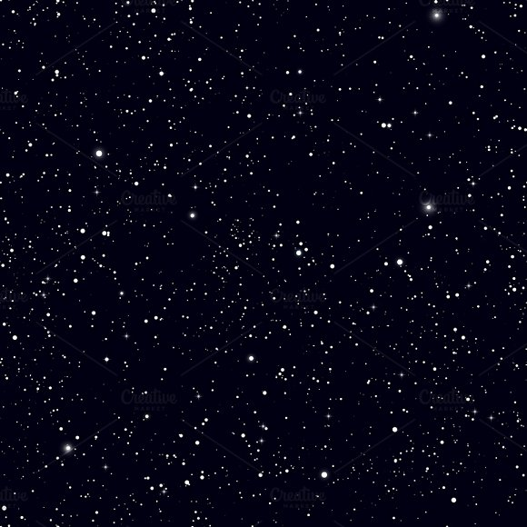

**Pour le temple Azteque :**
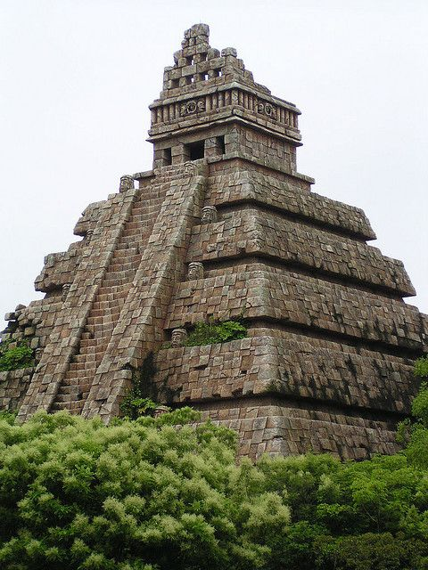
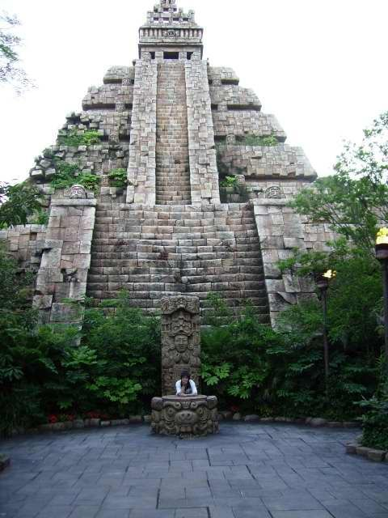
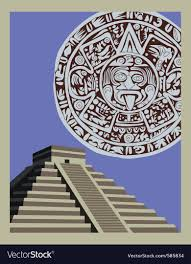

## SOURCES & MATÉRIELS
### L'ÉLECTRONIQUE
Afin de faire notre jeu, nous avons besoin :

* 1 carte Arduino
* 1 résistance 10K
* 1 capteur thermique
* 3 microphones (2 pour la montgolfière et 1 pour la sarbacane)
* 1 capteur distance

### LES OBJETS
#### La montgolfière
Afin de faire la structure de notre "ballon" et concentrer a chaleur sur le capteur thermique, nous avons fait une structure en forme de cône en métal.

Nous avons ensuite créer la cabine en carton plume et nous avons mis la carte arduino à l'intérieur où tous les capteurs seront branchés. Nous avons attaché la cabine à la structure en métal entouré d'alluminium afin de concentrer la chaleur sur le capteur thermique, qui est tout attaché tout en haut de celle-ci. Nous avons fait 3 trous dans la cabine: une pour la sortie USB de la carte Arduino, et deux pour les deux sorties microphones sur les deux côtés de la cabine.

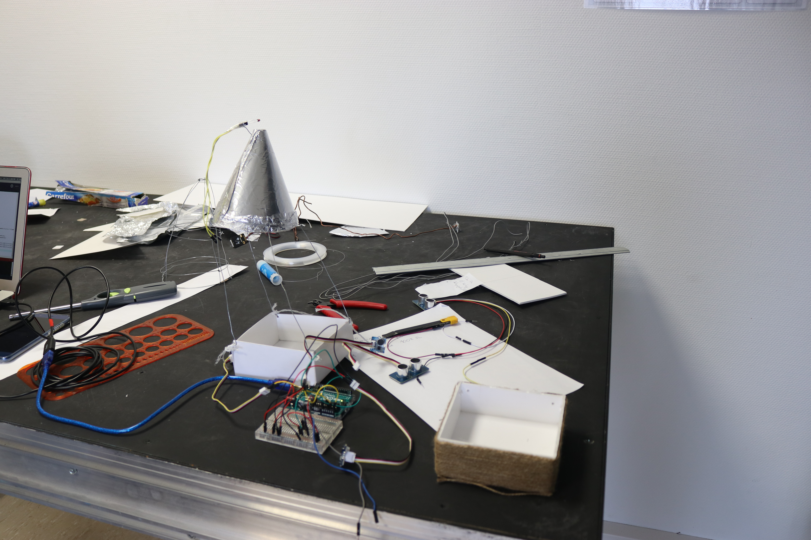

Nous avons ensuite gonflé un ballon et nous l'avons entouré de papier afin d'avoir la forme d'une montgolfière.

Enfin, nous l'avons accroché au plafond et nous l'avons décoré (fil sur la cabine et papier rouge et blanc autour du ballon). Nous avons ensuite tout branché sur la carte Arduino (cf. photo schéma).

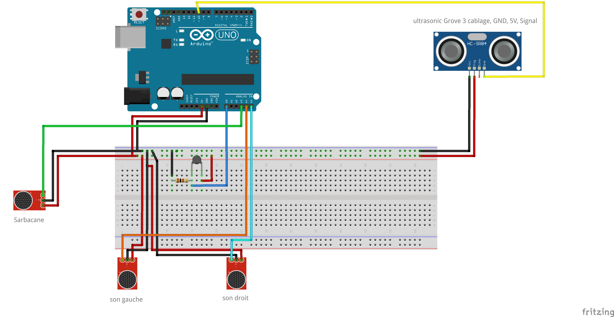

#### LA SABARCANE
Pour celle-ci, nous avons juste pris un tuyau transparent d'environ 30cm de long, et nous avons scotché le troisième micro au bout du tuyau.

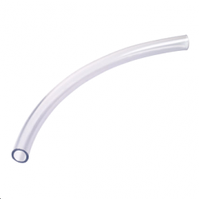

### L'INSTALLATION
Comme dit en-dessous, nous avons attaché la montgolfière au plafond et nous avons acheté un briquet pour la montgolfière.
Nous avons décidé d'utiliser un vidéo projecteur sur un mur blanc comme écran.

Pour le capteur de distance pour le deuxième joueur, nous l'avons scotché sur le bord de la table. 

[**home**](../README.md)

