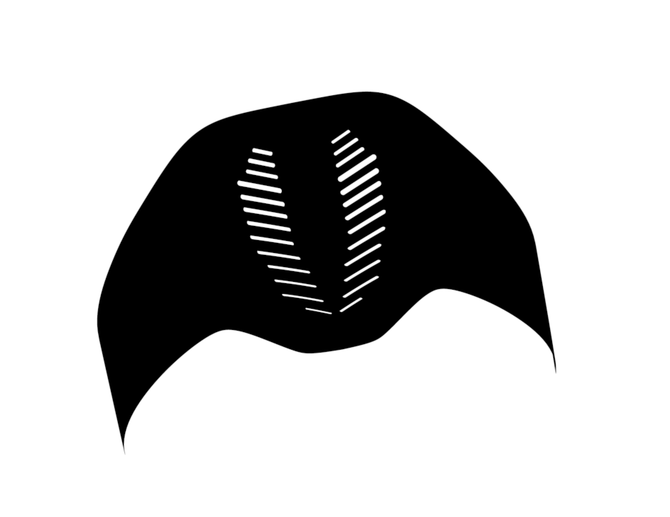
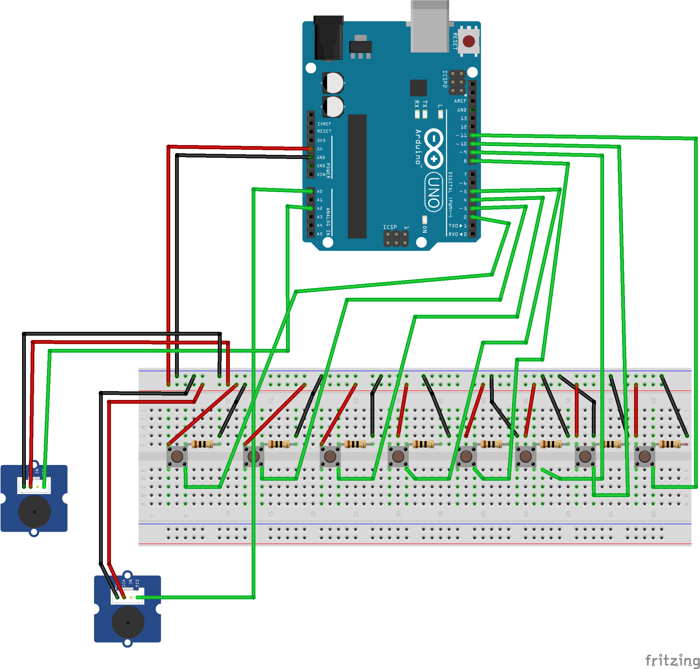

[**home**](../README.md)

## Projet Arduino : Praiyds

 
###### Jeu réalisé par Théotim Auger - Sarah Gergaux - Sophie Le Gallo - Virginie Souffoy I3 + GA

### Principe du jeu  
>  PRAYDS 2.0 est un jeu de chasse entre 2 joueurs :   
> Chaque joueur, à tour de rôle, incarnera le prédateur et l'autre, la proie. Ainsi pour chaque partie, le but du prédateur est d'attraper la proie et le but de la proie est d'échapper au prédateur.  
> Chaque partie partie à sa propre carte générée procéduralement :    
> - Le carré de votre couleur est un ralentisseur pour votre adversaire.  
> - Le cercle vous propulse dans un autre direction  
> - Le triangle de votre couleur fait perdre de la vie à votre adverse (proie ou prédateur). 

#### Matériels utilisés 
> 1 Cartes Arduino Uno  
> 2 Breadboards   
> 8 Boutons  
> 2 Capteurs de souffle
> Des fils conducteurs  
> 8 résistances 10K

#### Notice de montage 
 
 
> Pour réaliser le **montage** vous aurez besoin de planche de bois ou d'une autre matière si vous le souhaitez.  
> Munissez vous de colle/scotch pour assembler les supports.    
> Pour la réalisation des **casques** vous pouvez utiliser une imprimante 3Dou fabriquer un autre support afin d'y insérer les capteurs de souffle.

##### Code 
> Cf : **Praiyds_workshop** dans le dossier Auger_Gergaux_LeGallo_Souffoy 

#### Notice d'utilisation
1.  Enfilez chacun un casque mis à disposition
2.  Prenez place et prennez en main votre controller
3.  Soufflez dans le masque pour vous déplacez.
4.  Appuyez sur les différents boutons pour vous déplacez   
5.  Attrapez l'autre joueur ou fuyez-le  !

#### Schéma de montage
 

>
>
##### Théotim Auger - Sarah Gergaux - Sophie Le Gallo - Virignie Souffoy

[**home**](../README.md)

