# workshop_alt_ctrl_1920

[Code and documentation](https://github.com/AtelierNum/workshop_alt_ctrl_1819) for the alternative controller workshop by interaction and game design students @lecolededesign.

Students were asked to imagine an alternative way to play and design an unusual controller and the game associated with it in four days..

Files can be found on [github](https://github.com/AtelierNum/workshop_alt_ctrl_1819)

[Code et documentation](https://github.com/AtelierNum/workshop_alt_ctrl_1819) pour le workshop "controleur alternatif" réalisé par les étudiants en design d'interaction et de game design @lecolededesign. Ce projet est réalisé à l'aide d'arduino.

Les étudiants avait pour mission, en quatre jour d'imaginer un controleur de jeu vidéo alternatif ainsi que le jeu vidéo associé.

Les fichiers peuvent-être téléchargés sur [github](https://github.com/AtelierNum/workshop_alt_ctrl_1819)

---
## ColorWaves

Ce projet a été réalisé par : Alia ElKayar, Armand Lemaitre, Guillaume Le Mené & Slévin Vleöbergh

La documentation du projet est disponible [ici](ColorWaves/README.md)

---
## Shiffoumort

Ce projet a été réalisé par : Enzo Wattebled I3A / Quentin Thomas / Maxime Thureau / Morgane Thomas / Baptiste Marionneau

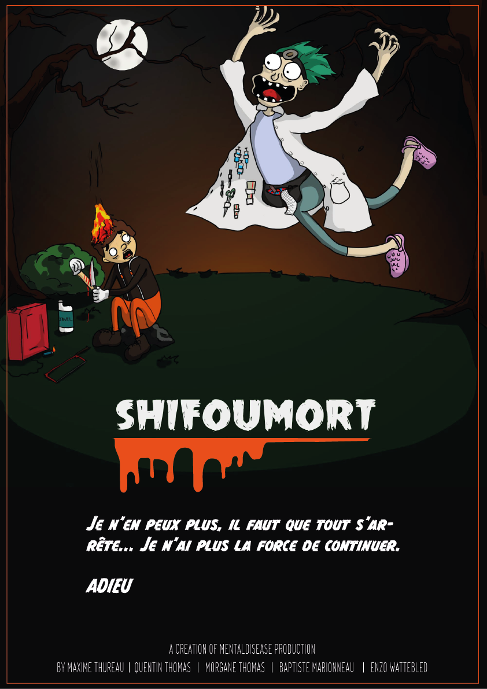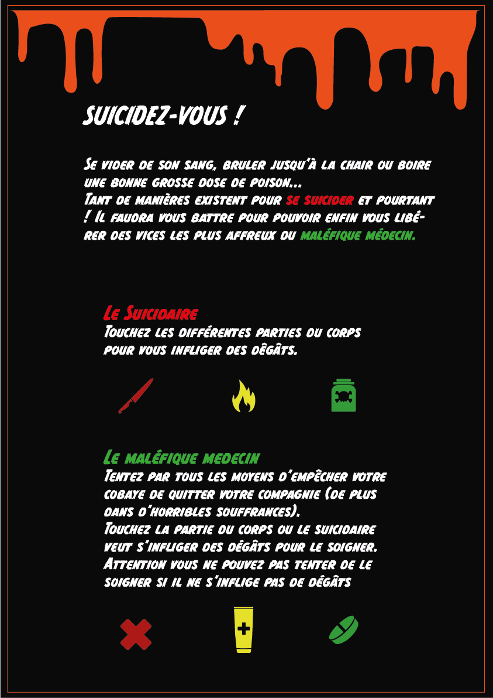

La documentation du projet est disponible [ici](Shiffoumort/README.md)

---
## La Pépite

Ce projet a été réalisé par : Fabien Gachet-Thoumine, Aurélie Caré, Auriane Pouzin et Quentin Hamon.

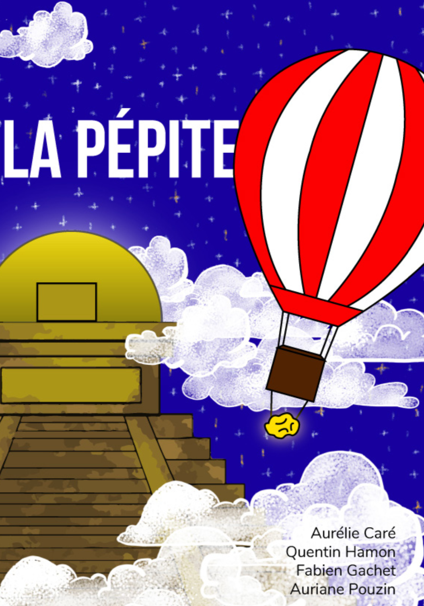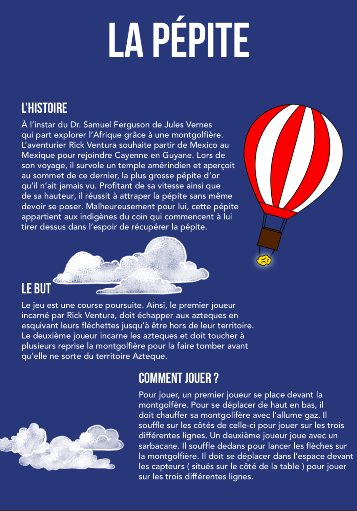

La documentation du projet est disponible [ici](Pepite/README.md)

---
## Hysteric Jumper

Ce projet a été réalisé par : Lengliang LI - Yacine El Makhzoumi - Samuel Lefebvre - Camille Campo

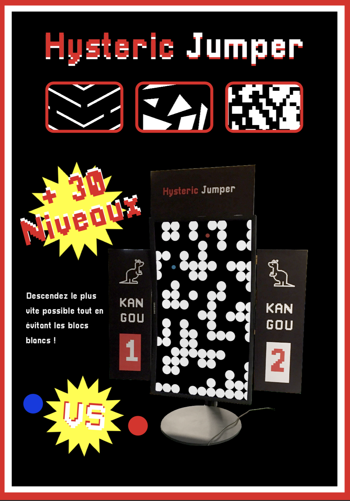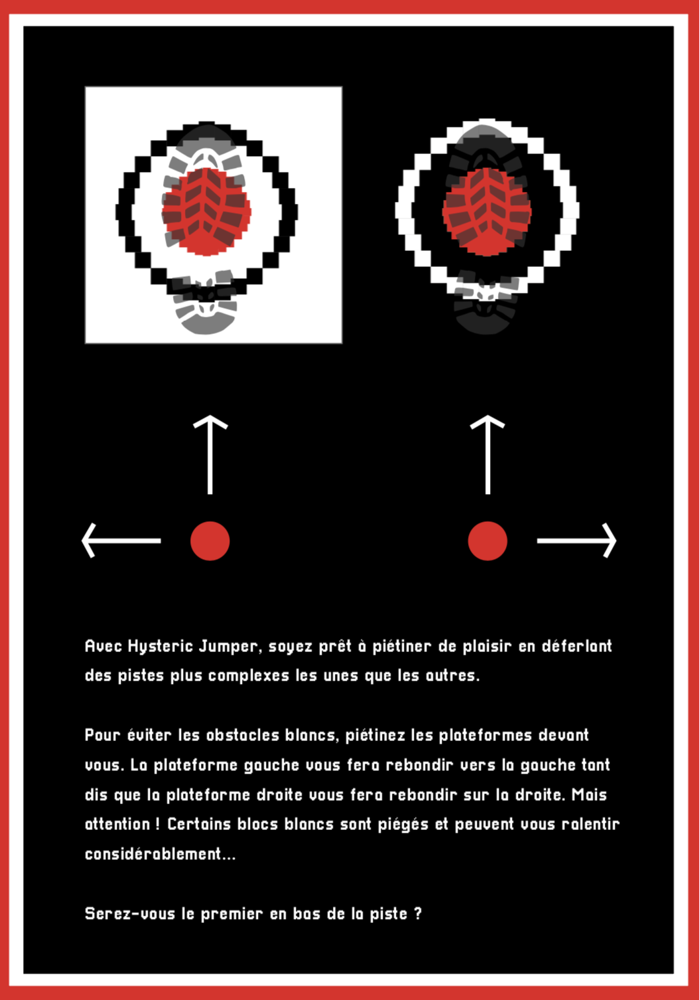

La documentation du projet est disponible [ici](HystericJumper/README.md)

---
## Cosmo

Ce projet a été réalisé par : François Arnaud, Loïc Renaud, Baptiste Deroche et Paul Poirier

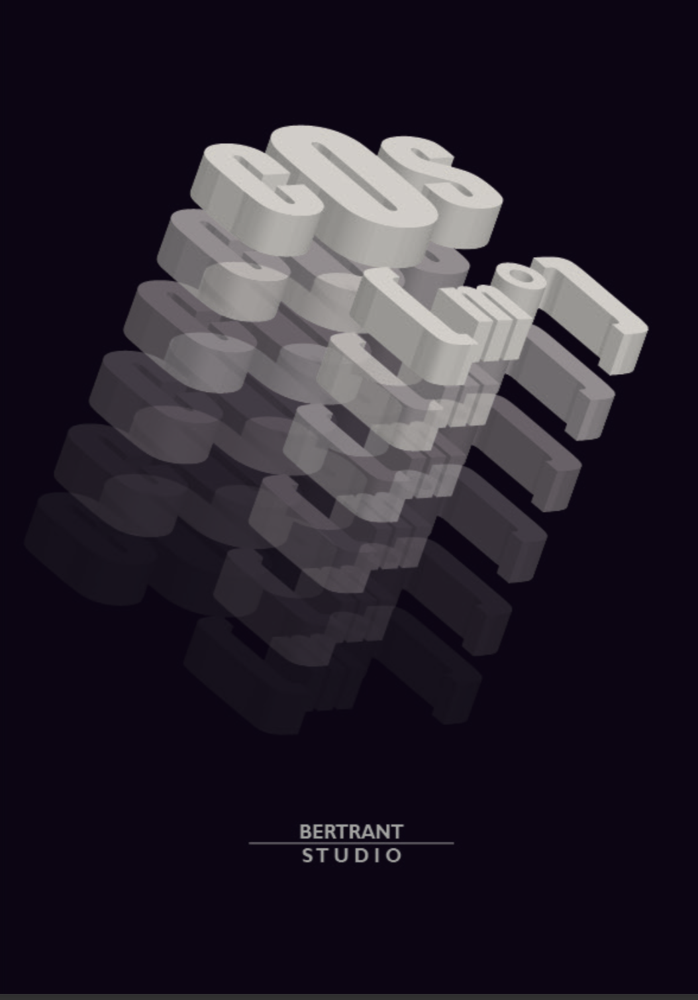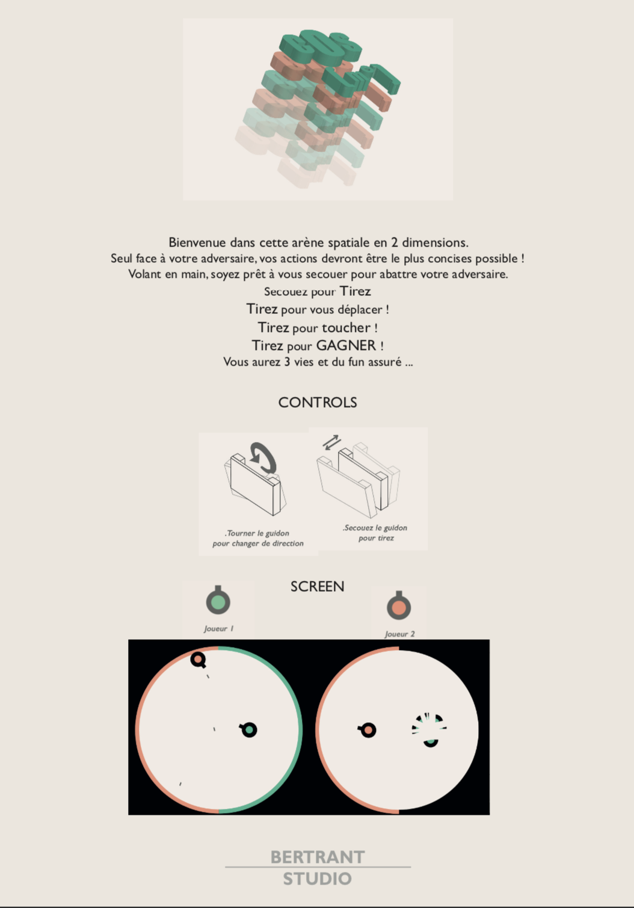

---
## Fireflies

Ce projet a été réalisé par : Baptiste Guerin, Salomé Gloanec, Alix Gora et Manon Leverrier.

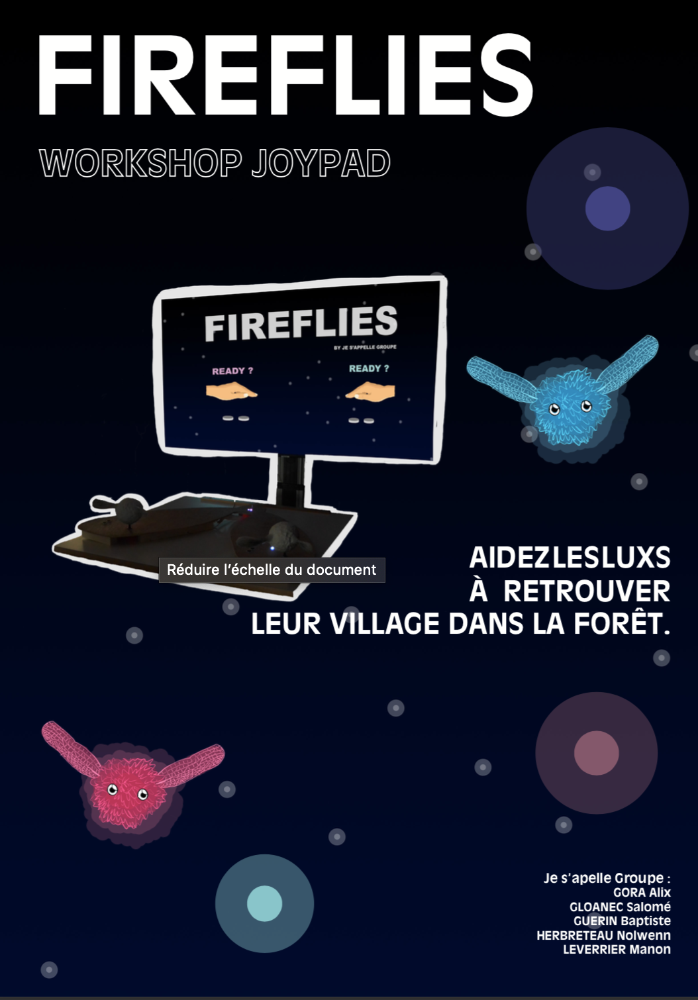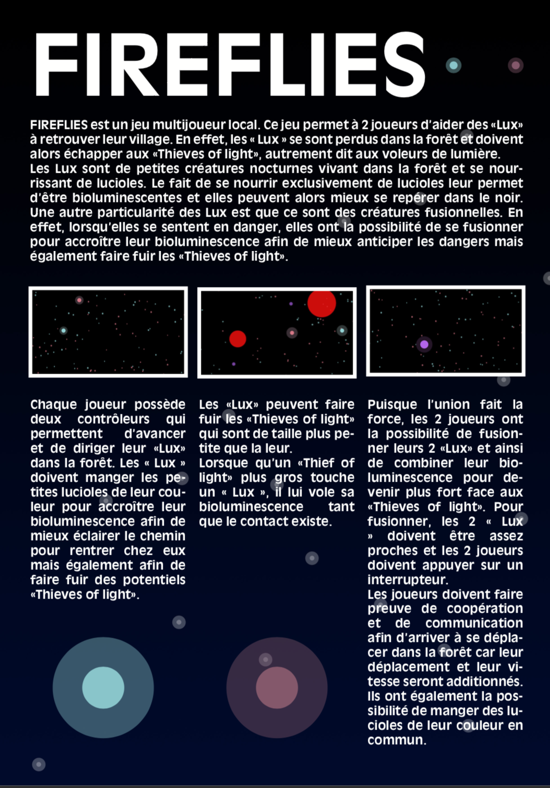

---
## Prayds

Ce projet a été réalisé par : Théotim Auger - Sarah Gergaux - Sophie Le Gallo - Virignie Souffoy

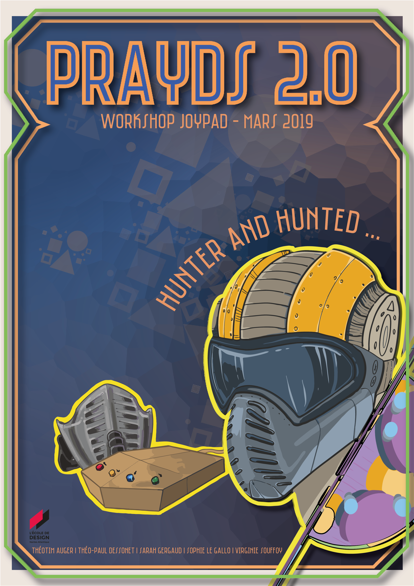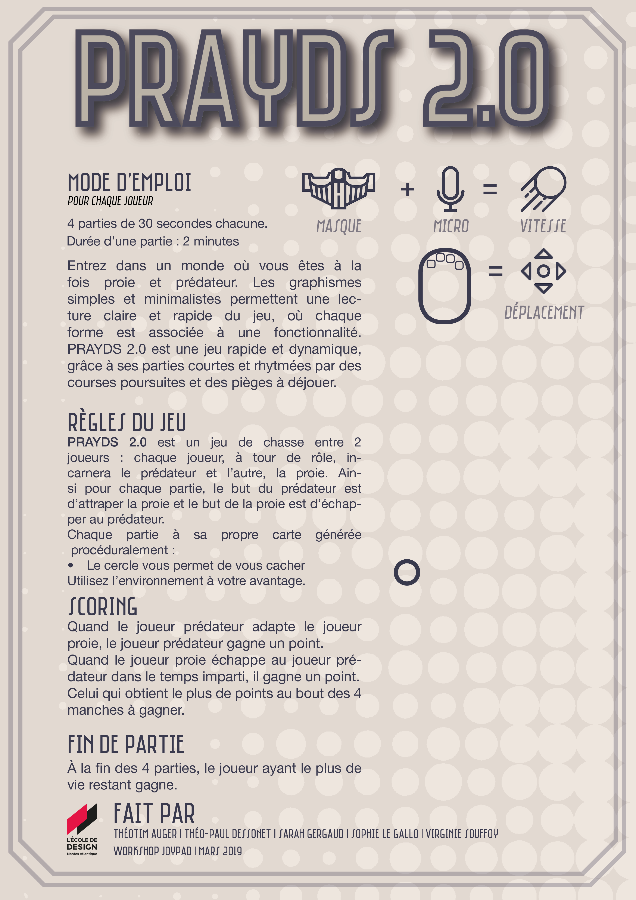

La documentation du projet est disponible [ici](Prayds/README.md)

---
## Be Quiet

Ce projet a été réalisé par : Simon Renault, Martin Lamire, Christophe Le Conte, Andrews Kimbembe et Sébastien Reischek

[**home**](../README.md)