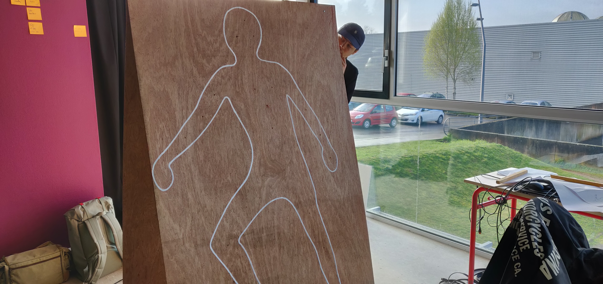

[**home**](../README.md)

## "SHIFOUMORT"

Jeu électronique utilisant arduino - 2 joueurs

Réalisé par Enzo Wattebled I3A / Quentin Thomas / Maxime Thureau / Morgane Thomas / Baptiste Marionneau

Workashop Joypad réunissant Interaction design & Game design, L’École de design Nantes Atlantique - du 4 au 8 février 2019

 
 

 
 

## Background du jeu 
 
ShiFouMort est un jeu opposant deux joueurs, un suicidaire et un soignant. Chacun dispose d’une silhouette humaine devant lui avec différentes zones tactiles. ainsi qu’une barre de vie affichant l’état du patient.
Le but du suicidaire est de se tuer dans le temps imparti. Pour se faire il utilise ses petites mains pour sélectionner l’arme à utiliser dans la zone qu’il veut. Tant qu’il ne la retire pas de la zone, le patient perds de la vie.
Le soignant va quand à lui devoir garder le patient en vie durant le temps imparti. Pour se faire, il doit écouter le son qu’il entend afin de pouvoir identifier l’arme sélectionnée et ensuite placer sa main sur la case correspondante dans la zone en surbrillance. En laissant sa main posée, il va pouvoir soigner le patient jusqu’à ce que l’autre joueur se retire.
Bien sûr, les joueurs ont deux mains et potentiellement leurs genoux, coudes, genoux, pieds, tête, etc … 
ShiFouMort mélange des mécaniques de rythmes et des stratégies de triangularité (ex: le chifoumi, twister …), le gameplay repose sur les compétences de réflexes du joueur.
 
 

### Réflexion 
Comment en sommes-nous arrivés à ce thème ?
Nous sommes partis de l’idée de créer une interface tangible utilisant différents matériaux ou objets pour intéragir dans le jeu. Nous avons naturellement pensé à un homme voulant sauter d’un immeuble. Il aurait fallu le sauver en plaçant des matériaux adaptés à l’endroit de son atterrissage. Cette idée a ensuite évoluée : donner le choix entre sauver le personnage ou dramatiser la manière dont il meurt en mettant, par exemple, des pieux à l’atterrissage.

Nous avions donc la base de notre jeu. Le jeu se prétait parfaitement a un gameplay a deux. Un joueur doit tuer son personnage pendant que l’autre doit l’en empêcher en le soignant. Pour ce qui est du gameplay, nous avons gardé cette idée d’interface tangible avec des cubes de blessures et de soins à poser sur une silhouette de corps. En quelques sortes un mode 2.0 inversé du docteur Maboul. Mais nous l’avons fait évoluer, pour des raisons techniques et dynamiques, nous avons supprimé les cubes. Les joueurs toucheront directement les parties du corps grâce à leurs mains.
 
 
 

## Le circuit
 

### Les composants
1 Carte Arduino Uno  
1 Câble USB  
2 Breadboards  
4 Capteurs de contact MPR 121  
1 Ruban LED de 49  
12 Résistances 10K  
12 LED  
Beaucoup de câbles 
 
 

### Notice de montage 

Le montage montre le branchement de deux capteurs se répondant. Nous avons 12 capteurs et 12 LED, il suffit de dupliqué ce montage pour chaque composant. 

 
 
 

## Fonctionnement du jeu
 

### Sur arduino
On va séparer le programme en 3 parties qui vont nous permettre de séparer les différentes étapes du jeux, comme sur le schéma suivant.

On a donc un départ, durant lequel on reset les informations nécessaires avant le commencement de la partie et on affiche le top départ.

On passe ensuite à la partie qui correspond au déroulement du jeu. Durant celle ci, on établi les différentes combinaisons nous faisant gagner ou perdre de la vie et on affiche ça sur notre ruban de led/Barre de vie. puis un check s’il y a victoire.

Et enfin on arrive à la victoire, période durant laquelle on affiche la couleur du vainqueur sur le ruban de leds.
 
 

### Sur processing
Processing est utilisé simplement pour lire les sons lorsqu'une action se fait.
 
 
 

##Maquette
 
Pour mettre tout ça en place, nous avons installé deux planches de bois face à face afin de pouvoir oppaser médecin et suicidaire.

Dessus, nous y avons dessiné nos silhouettes taille réelle et placé les différentes zones touchables. 

Sur chacune de ces zones, on a fait un petit trou pour faire passer le fil lié au capteur, dont l'extrémité est ensuite couverte de pâte à moderler, et un second trou pour faire passer la led, qui elle indiquera si l'adversaire touche cette zone.

Un installe ensuite un ruban de led sur le haut de ces planches, bien visible par les deux joueurs.

Les planches ne sont pas à la verticale mais légèrement en bians afin de garder un espace entre elle pour faire le montage et placer la carte arduino.

 
 
 

## Sources
 
“l’Art du game design” - J. Schell, 2010, Pearson Education France

On remercie Clément Gault de nous avoir fourni les différentes animations de leds utilisées, mais aussi Pierre Commenge et Bérenger Recoules pour nous avoir écouté et dépanné sur le code et Thomas François pour son accompagnement.

[**home**](../README.md)

