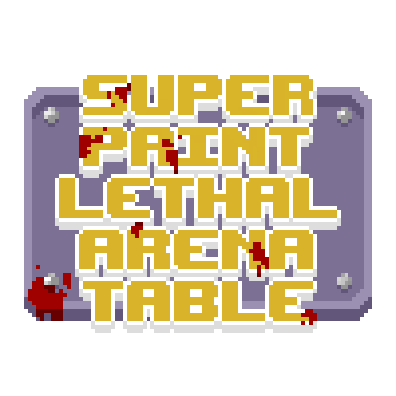
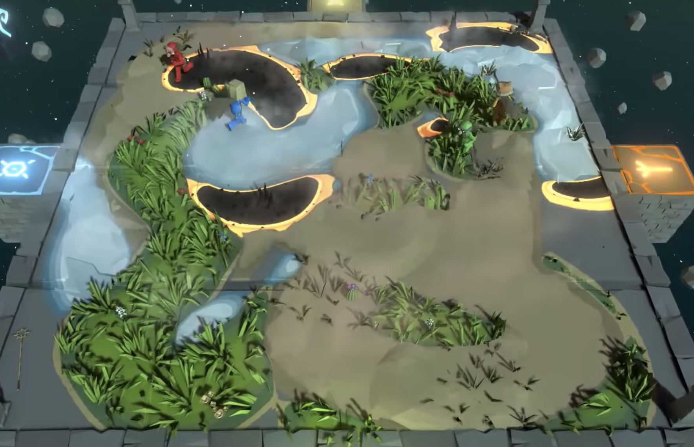
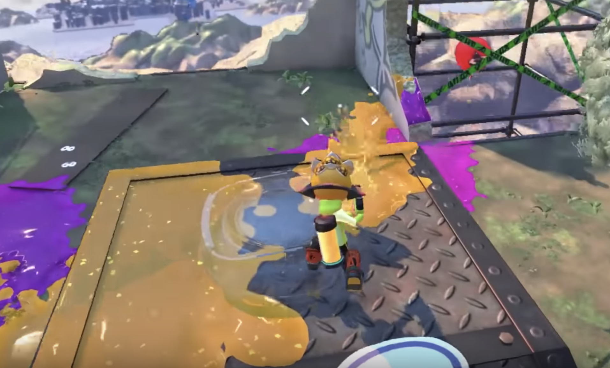
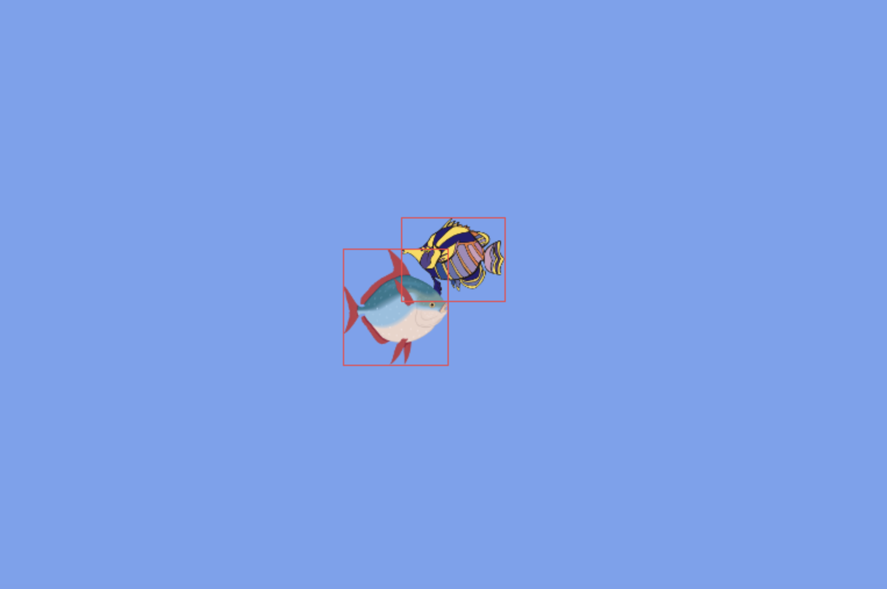
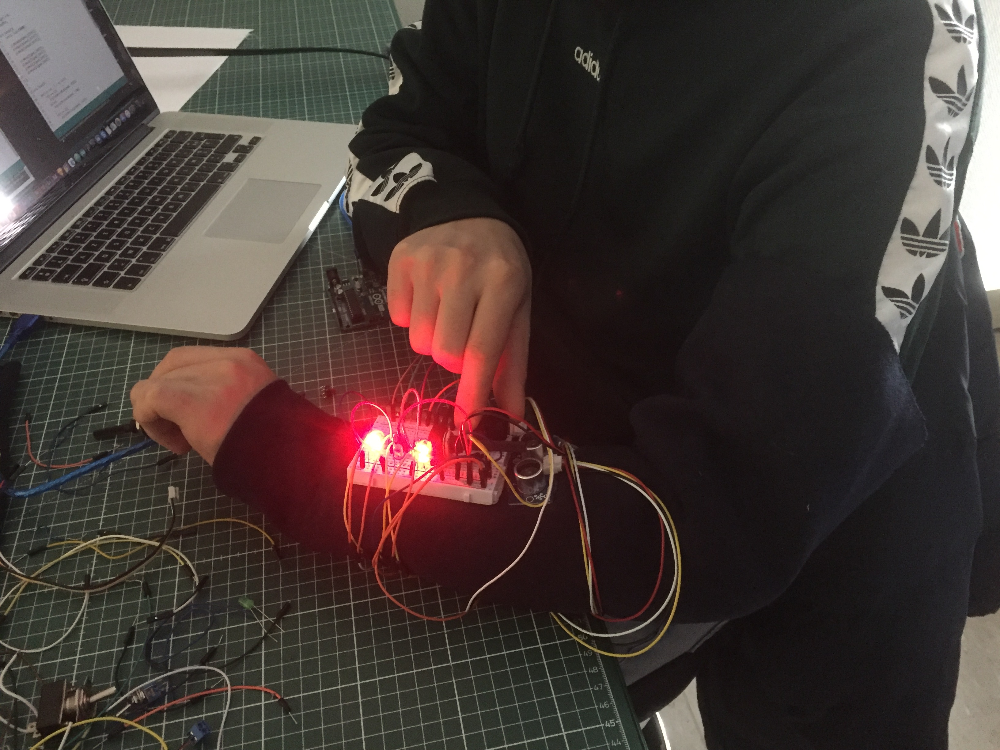
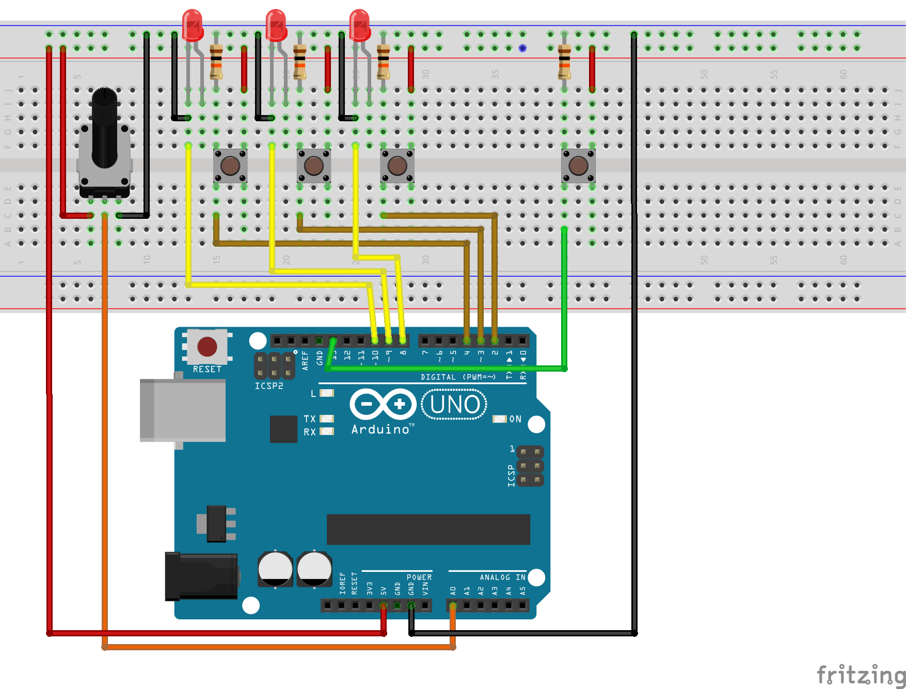
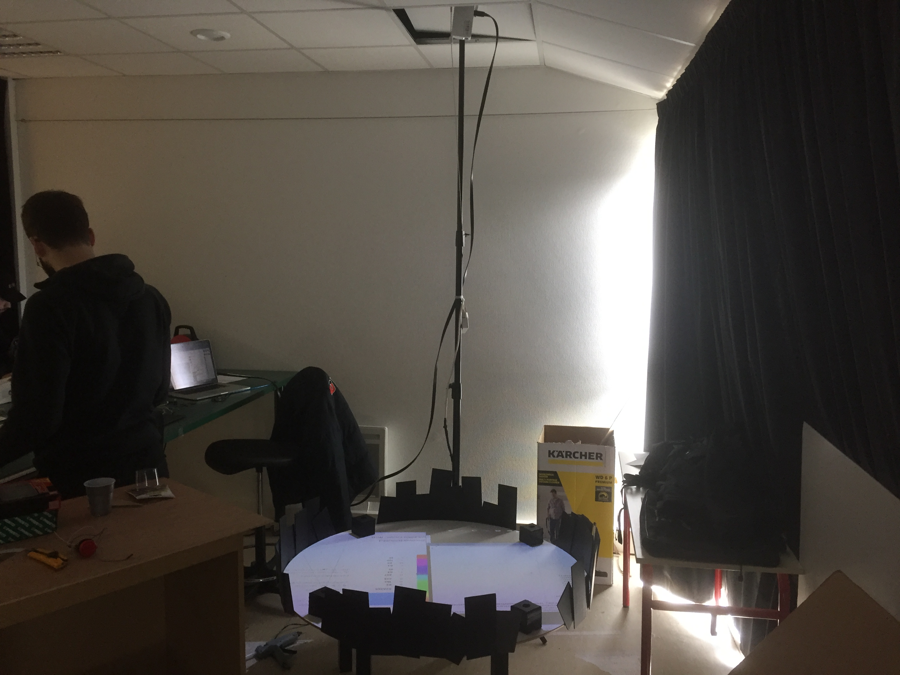
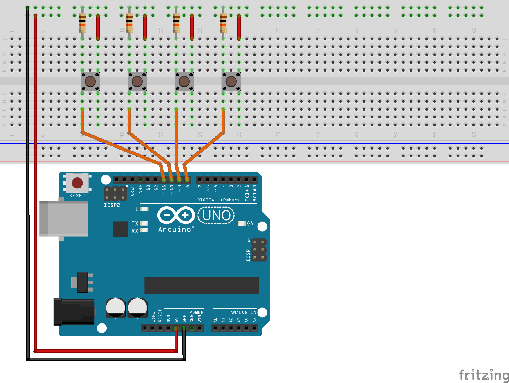

[**home**](../README.md)

# SUPER.PAINT.LETHAL.ARENA.TABLE

*Petit jeu électronique basé sur Processing et Arduino, réalisé par Antoine Cesbron, Mathis Freudenberger, Pierre Fontaine et Victor Ducrot, étudiants en 3e année.*

   

## Sources

#### 1/ Inspirations
Nous avons commencé par faire une veille de petits jeux / mini jeux. Nous sommes tombé sur des vidéos de Pummel Party et Mario Party. Des jeux basés sur un plateau, comme une sorte de jeu de société, et les joueurs avance petit à petit en jouant à des mini-jeux. Nous avons remarqué qu'un mini-jeu revenant souvent, recouvrir le plus de surface possible dans une arène, ou plusieurs joueurs s'affrontent, comme dans Splatoon également. Nous nous sommes alors inspiré de ces jeux la pour développer S.P.L.A.T. 

 

#### 1/ Code

* La collision au pixel prêt : [https://www.openprocessing.org/sketch/149174/](https://www.openprocessing.org/sketch/149174/ "Title") 

* Chaîne Youtube The Coding Train : [https://www.youtube.com/user/shiffman/videos](https://www.youtube.com/user/shiffman/videos "Title")

* Doc Processing : [https://processing.org/reference/](https://processing.org/reference/ "Title")

  

## L'Histoire
Approchez Approchez ! Venez participer au SPLAT ! Le tournoi le plus sanglant de la Vallée Desséchée ! Passez un dernier coup de fil à vos proches, (qui seront bien entendu retenus comme caution) équipez vous de notre équipement bon marché fabriqué avec amour avec ce qu’il y a de meilleur dans les décharges ! Tentez de gagner 6 litre d’essence et surtout, UN VERRE D’EAU FRAICHE ! Des denrées rares de nos jours ! Y’en a pour tout le monde, le public est invité à prendre part lui aussi. Nous encourageons fortement la projection d'objets contondants, mais par toutes les clefs de douzes ! Pas de pop corn, on en retrouve partout dans les gradins ! Attachez vos ceintures, faites vrombir ces moteurs fraîchement reconditionnés et tentez votre chance pour seulement 40 boulons!

  

## Les règles
Deux joueurs contrôlent chacun une voiture lachant une trainée de peinture. Ils peuvent démarrer et diriger la voiture grâce à différents boutons. 
Il y a une première phase de lobby pour prendre en main les contrôles. Ensuite la partie démarre, au travers de trois rounds les joueurs devront recouvir la plus grande surface de l’arène. 
Les joueurs peuvent ramasser des objets sur le terrain qui les aideront dans la partie. Les spectateurs peuvent également intéragir dans la partie en déclanchant des événements climatiques qui pénaliseront les joueurs. A la fin de chaque round, une zone, définie aléatoirement dans l'arène, se rétrécie et contraint les joueurs à finir la partie dans un territoire beaucoup plus petit. Si ils rentre en collision avec le round s'arrête pour eux. 
À la fin des trois rounds le joueur qui en a gagné deux remporte la partie.

  

## Les bonus

#### 1/ Les bonus pour les joueurs
Une bombe de peinture et une pillule pour augmenter la taille de la trainée, dissimulés dans l’arène. Ils apparaissent toutes les 10 secondes. 

#### 2/ Les évènements déclénchés par les spectateurs
Un tsunami qui efface toute la peinture, un tremblement de terre qui stop les joueurs, un ouragan qui deplace les voitures et un éboulement qui fait disparaitre les obstacles. Ils sont utilisable une fois par partie. 

  

## Le matériel
* 2 potentiomètres
* 6 petits boutons pressions
* 4 gros boutons pressions
* Bandes de carton noir
* 4 carrés en carton noir
* 1 table
* 1 vidéo projecteur Pico

 

### LE BRACELET

#### 1/ Le principe

Les contrôleurs pour joueur sont placés sur un bracelet / manche. La carte Arduino y est attachée, ainsi que les différents capteurs : le potentiomètre pour la direction et les 3 boutons associés à des leds pour redémarrer la voiture.  
Le style est délibérement post-apocalyptique, avec des cables qui dépassent, une multitude de capteurs (qui ne servent pas forcément à quelque chose) ... etc. 

#### 2/ Le montage

 

### L'ARÈNE

#### 1/ Le principe

Les joueurs jouent autour d'une table sur laquelle est projetée le jeu. Nous avons placé des bande de carton noirs tout autour de la table pour recréer l'ambiance d'une arène. Des petites boites avec des boutons sont aussi placées tout autour afin de permettre au spectateurs de déclencher les évènements. 
 
Le video projecteur pico est placé juste à côté de la table et projette par le haut. 

#### 2/ Le montage

  

## L'Arcade Flyer

  

## Pour aller plus loin
Dans l'optique de rendre le jeu encore plus immersif et amusant, nous aurions aimé ajouter quelques améliorations si nous avions eu plus de temps. Tout d'abord proposer différents capteurs et déclencheurs pour les malus climatiques déclenchés par les spectateurs, avec par exemple un capteur de souffle ou de bruit pour le vent ou un capteur de pression pour le tremblement de terre ... etc. Ensuite au niveau du nombre de joueurs nous aurions voulu proposer la possibilité de jouer à 4, pour augmenter encore plus le nombre de personne autour de la table et l'esprit d'arène. Toujours dans l'esprit d'arène du vrai sable pourrait être placé sur l'arène et pourquoi pas même des vraies voitures qui circulent dedans et qui produisent virtuellement la peinture grâce à du mapping. 

 
____

### Merci de votre lecture

 
Antoine Cesbron  
Mathis Freudenberger  
Pierre Fontaine  
Victor Ducrot  
3e année

[**home**](../README.md)

